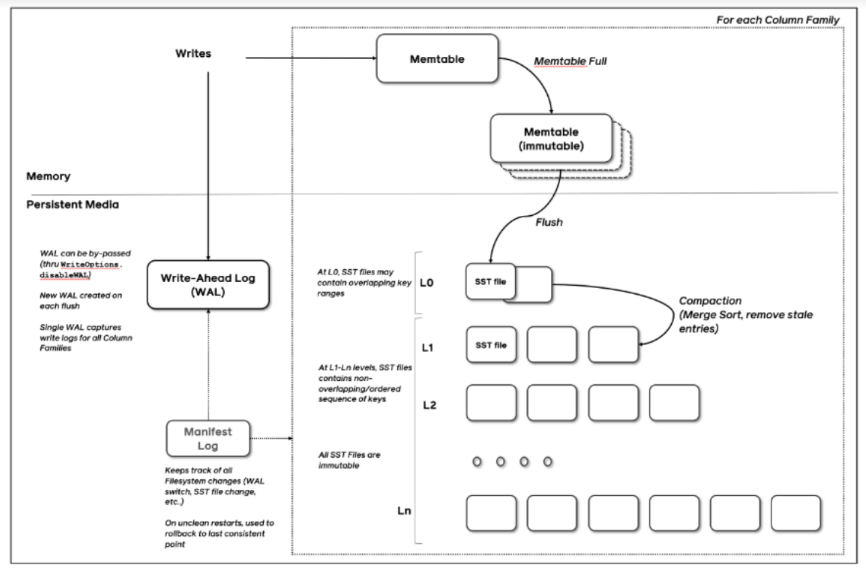
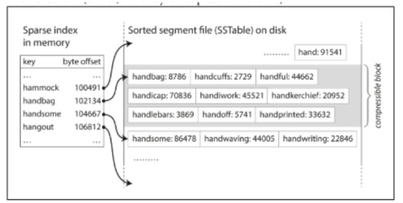

# 요약
- 키-값 자료 구조에서 Log Structured File을 사용한 Hash Indexes 방식의 장점과 단점은 무엇인가요?

Log Structured File을 적용한 Hash Indexes 방식은 데이터를 갱신할 때 즉각적으로 갱신하지 않고 임시로 중복된 키를 허용합니다.
한번 저장된 데이터는 수정이 불가능한 불변으로 이는 동시성 문제를 해결할 때 간편하다는 장점이 있습니다.
또한 삽입이 순차적으로 이루어지므로 쓰기 효율이 좋다는 장점도 있습니다.
하지만 Hash Indexes 방식은 특정 범위의 쿼리를 조회할 때 비효율적입니다.
또한 인메모리의 경우 모든 키-값을 메모리에 저장하므로 많은 데이터를 저장할 수 없습니다.

- Lsm-Tree 방식은 어떠한 장점을 가지고 있나요?

Lsm-Tree 방식은 Hash Indexes의 불변 데이터 방식을 채택하여 동시성 문제, 쓰기 효율의 장점을 가져옵니다.
추가로 SSTable을 정렬하고 SSTable의 offset만을 메모리에 저장하여 특정 범위의 쿼리도 Hash Indexes 방식보다 효율적으로 조회하고 메모리에 저장되는 데이터 크기를 줄일 수 있습니다.
또한 디스크에 저장할 때 쓰기 지연 방식을 채택함으로써 B-Tree보다 대용량 데이터 쓰기에 좋은 효율을 보입니다.

# 서론
이번 졸업 과제로 Lsm-Tree 구조를 사용하는 데이터베이스를 직접 구현하는 주제를 맡게 되었다.
따라서 본격적인 개발 전에 Lsm-Tree는 무엇이고 어떤 특징을 가지고 있는지 먼저 조사해서 정리해보았다.

# Lsm-Tree
## 개요
현대 대규모 어플리케이션에서는 소셜 미디어, 스마트 센서, 서드 파티 데이터베이스와 같은 다양한 소스의 빅데이터를 처리한다.
이러한 이질적인 데이터에 테이블 형식 구조를 적용하면 중복 및 성능 문제가 발생할 수 있다.

NoSQL 중 Lsm-Tree 기반의 키-값 데이터베이스 구조는 이러한 대용량 데이터를 처리할 수 있다.
Lsm-Tree는 NoSQL 데이터베이스의 주요 자료 구조로 쓰기 지연 방식 등을 통해 쓰기 효율을 극대화한다.
그러므로 Lsm-Tree는 다른 자료 구조와 비교해 대용량 데이터 삽입에 높은 효율을 보여 다양한 대용량 데이터 처리 작업에 널리 활용된다.

## Log Structured File 기반 Hash Indexes
먼저 키-값 자료 구조 중 Log Structured File을 도입한 Hash Indexes 방식에 대해서 자세히 알아보자.
키-값 자료 구조의 가장 기본적인 저장 방식은 Hash Indexes 방식이다.
Python의 Dictionary와 Java의 HashMap처럼 키-값을 저장할 때 Hash를 사용하는 것이다.
이를 바탕으로 Log Structured File을 도입하여 쓰기 성능을 향상할 수 있다.
아래의 그림은 인메모리 Log Structured 기반 Hash Indexes 방식의 예시를 보여주고 있다.

간단해보이지만 꽤 강력한 방식으로 키의 수가 아주 많지 않은 상황에서 키가 자주 업데이트 되는 경우 유용하게 사용할 수 있다.
실제로 Riak DB의 스토리지 엔진은 이러한 구조를 바탕으로 하고 있다.

또한 Log Structured File 방식에서 주요한 특징으로 **데이터는 한 번 삽입되면 수정할 수 없는 불변 특성**을 가진다.
갱신된 데이터가 입력되면 즉각적으로 수정하는 것이 아닌 일단 중복 키를 허용하고 내버려둔다.
데이터 단위인 세그먼트의 크기가 일정 수준에 도달하면 그 때 중복 키를 제거하는 압축 과정이 수행되는 것이다.
이 과정에서 여러 세그먼트를 하나의 세그먼트로 압축할 수도 있다.

이렇게 중복 키를 허용하고 압축하는 방식은 다음과 같이 여러 이점을 가진다.
- 삽입과 세그먼트 병합 과정이 순차적으로 이루어지므로 랜덤하게 쓰는 과정보다 빠르다.
- 데이터가 불변일 경우 동시성 문제와 충돌 회복을 간단하게 구현할 수 있다.
- 오래된 세그먼트를 병합하는 과정은 데이터가 파편화되는 것을 막는다.

하지만 인메모리 Hash Indexes 방식은 모든 데이터를 인메모리에 담는 특성 상 많은 용량의 데이터를 담기 힘들다.
또한 무엇보다 **특정 범위를 조회하는 쿼리에 대해서 효율적이지 않다는 문제**가 있다.
Lsm-Tree는 이러한 문제를 SSTable을 이용하여 해결한다.

## Lsm-Tree
Lsm-Tree(Log Structured Merge Tree)는 디스크나, 플래시 메모리 저장 시스템에서 키-값을 효율적으로 저장할 수 있는 자료 구조이다.

Lsm-Tree도 Log Structured File 방식을 도입하여 모든 데이터는 불변이며 중복을 허용하고 압축하는 방식이다.
Hash Indexes와 큰 차이점은 **SSTable로 불리는 세그먼트들이 여러 계층으로 정렬되어 있다**는 점이다.
압축 시에도 인접 SSTable과 합병 정렬을 수행함으로써 정렬 순서가 유지되며 가장 최신의 키를 제외하고 제거된다.

또 하나의 차이점은 기존의 Hash Indexes는 모든 데이터에 대한 키를 메모리에 가지고 있었다면 Lsm-Tree는 **메모리에 각 SStable의 offset만을 저장하고 있다.**
이는 SSTable이 정렬되어 있기에 가능한 방식이다.

위의 그림처럼 handiwork 데이터를 찾고 싶다고 가정하자.
handiwork는 사전 순으로 handbag과 handsome 사이이다.
데이터는 정렬되어 있으므로 handbag을 포함하는 SSTable로 이동하여 handiwork가 존재하는 지 찾을 수 있다.
이렇게 저장하면 모든 키를 저장할 필요 없이 SSTable의 대표 키와 offset 만을 메모리에 저장함으로써 기존 Hash Indexes보다 메모리에 저장되는 데이터 양을 절약할 수 있다.

## Lsm-Tree의 쓰기 연산
Lsm-Tree는 B-Tree와 비교하여 대용량 데이터를 쓸 때 특화되어 있다.
Lsm-Tree는 쓰기 연산이 수행되면 바로 디스크에 저장되는 것이 아닌 memtable이라 불리는 인메모리 자료 구조에 데이터가 저장된다.
인메모리이므로 디스크보다 훨씬 빠르게 쓰기 작업이 수행된다.
memtable의 용량이 일정 크기를 초과하면 그 때 데이터가 디스크에 SSTable로 저장된다.
이렇게 **쓰기 작업이 있을 때마다 바로 데이터를 디스크에 쓰는 대신 메모리에 보관했다가 한번에 쓰기 때문에 랜덤 I/O를 줄여 쓰기 성능을 향상**할 수 있다.
SSTable의 데이터는 한번 저장되면 수정될 수 없는 영속 파일 형식으로 주기적인 압축 과정을 통해 오래된 SSTable의 데이터를 정리한다.

B-Tree는 랜덤 읽기에 좋은 효율을 보이지만 대량의 데이터가 삽입되면 외부 메모리가 파편화되어 더 많은 랜덤 I/O가 발생한다.
이는 긴 탐색 시간으로 이어져 쓰기 성능이 Lsm-Tree에 비해 떨어지게 된다.
위의 그래프와 같이 저장하는 데이터의 양이 많아질 수록 B-Tree는 Lsm-Tree에 비해 쓰기 작업에 더 많은 시간이 소요됨을 확인할 수 있다.

Lsm-Tree의 경우 여러 계층의 트리를 가지고 있다. 계층이 높아질수록 계층이 저장할 수 있는 크기는 지수적으로 증가한다.
가장 작은 0번째 계층은 인메모리 자료 구조인 memtable로 memtable의 용량이 일정 크기를 초과하면 그 다음으로 작은 1번째 계층에 병합된다.
이렇게 쓰기 작업을 지연시키고 한번에 디스크에 저장하는 과정으로 B-Tree에 비해 대용량 데이터 쓰기에 좋은 효율을 보이는 것이다.

# 결론
Lsm-Tree는 Log Structured 방식에서 사용하는 데이터 불변과 압축 과정을 바탕으로 SSTable의 정렬을 도입한다.
쓰기 지연 방식으로 대용량 데이터 쓰기 효율을 높임으로써 동시에 Hash Indexes 대비 적은 메모리 용량을 사용한다.

따라서 Lsm-Tree 기반 키-값 데이터베이스는 현대 어플리케이션의 대용량 데이터 처리에 많이 활용되는 것이다.

# Reference
[https://aws.amazon.com/ko/nosql/](https://aws.amazon.com/ko/nosql/)

M. Kleppmann, Designing Data-Intensive Applications, 1st ed. Addison-Wesley, 2017, the Big Ideas Behind Reliable, Scalable, and Maintainable Systems.

[https://www.scylladb.com/glossary/log-structured-merge-tree/](https://www.scylladb.com/
glossary/log-structured-merge-tree/)

J. Wang, Y. Zhang, Y. Gao, and C. Xing, “plsm: A highly efficient lsm-tree index supporting real-time big data analysis,” in 2013 IEEE 37th Annual Computer Software and Applications Conference, 2013, pp. 240–245.
