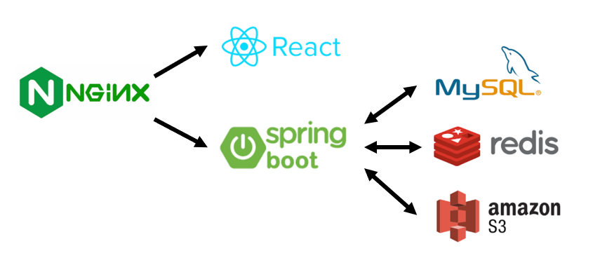

# 요약


# 서론
기존의 프로젝트를 빌드업하기 위해 여러 수정 사항을 도입하기로 하였다.
하지만 기존의 프로젝트는 k8s로 구성되어 있었고 개발 환경에서 설정이 복잡하여 k8s를 Docker Compose로 먼저 마이그레이션 후 개발하기로 결정하였다.
그 과정에서 Docker Compose를 어떻게 작성했는지에 관해 정리한 내용이다.


# Docker Compose?
Docker Compose는 여러 개의 컨테이너로 구동되는 어플리케이션을 정의하고 실행하는데 사용하는 도구이다.
k8s에 비해 간단한 설정으로 여러 개의 컨테이너 관리를 자동화할 수 있다는 장점이 있다.

## Docker Compose의 등장 배경
### 컨테이너 가상화
Docker Compose가 등장한 배경은 무엇일까?
현대의 어플리케이션에서는 컨테이너 가상화 기술이 많이 활용된다.
컨테이너 가상화 기술은 호스트 가상화와 달리 게스트 OS로 인한 오버헤드가 적기 때문에 확장 시 비용이 적다.
따라서 급속히 변화하는 사용자의 트래픽에 대응하기 위해 컨테이너 가상화 + 클라우드가 많이 활용된다.

하지만 현대의 어플리케이션의 규모가 갈수록 커짐으로써 어플리케이션에 모듈화를 도입하게 된다.
예를 들면 DB 컨테이너, 백엔드 컨테이너 등으로 각각의 기능마다 이미지를 만들어 컨테이너를 생성한다.
이 경우 백엔드 컨테이너에 많은 부하가 발생할 경우 새로운 백엔드 컨테이너를 생성하여 부하를 분산할 수 있다.

### 컨테이너 명령어로 생성하기
여러 개의 컨테이너로 구성된 어플리케이션을 실행한다고 가정하자.
이 때 각각의 컨테이너를 아래와 같은 Docker 명령어를 아래처럼 손수 입력하여 실행해야 한다.

```shell
docker run -d \
  --name backend \
  --env-file ./envs/backend.env \
  -p 8080:8080 \
  backend
```

## Docker Compose
Docker compose는 위와 같이 컨테이너 생성을 자동화할 수 있는 도구로 docker-compose.yml에 생성 방법을 정의할 수 있다.
이후 docker-compose.yml 파일을 실행만 하면 정의된 내용을 바탕으로 여러 개의 컨테이너들이 자동으로 생성된다.

Docker Compose는 단일 서버에서 여러 개의 컨테이너를 실행한다.
반면 k8s는 분산된 서버 환경에서 실행되고 scale in/out의 자동화를 지원하므로 실제 배포 환경에서는 k8s가 많이 활용된다.
하지만 개발 환경에서는 설정이 쉬운 Docker Compose를 활용하여 간편하게 개발할 수 있다.

# 현재 프로젝트 Docker Compose 구성하기
## 프로젝트 구조

가장 앞단에는 NGINX 서버가 존재하고 프론트/백엔드 어플리케이션이 존재한다.
백엔드 어플리케이션은 MySQL RDBMS에 데이터를 저장하고 인메모리 저장은 redis를 사용한다.
또한 백엔드 어플리케이션은 amazon S3에서 정적 이미지를 가져오므로 이를 위해 amazon S3 인증 정보를 백엔드 어플리케이션에서 가지고 있어야 한다.

## 필요한 이미지
- NGINX
- 프론트 어플리케이션
- 백엔드 어플리케이션
- MySQL
- Redis

# docker-compose.yml 작성
## 프론트엔드 어플리케이션
프론트엔드 어플리케이션은 우리가 직접 만든 어플리케이션이다.
따라서 docker hub에 이미지가 존재하지 않으므로 직접 빌드해서 이미지를 생성해야 한다.
이미지 만들기 위해서는 DockerFile이 프론트엔드 프로젝트에 존재해야 한다.
### docker-compose.yml
```yaml

```

### 프로젝트 내 DockerFile

## 백엔드 어플리케이션
백엔드 어플리케이션 이미지를 생성하기 위해서 마찬가지로 DockerFile이 있어야 한다.


```yaml
  backend:
    build: ..
    depends_on:
      - redis
      - mysql
    env_file:
      - envs/backend.env
    ports:
      - "8080:8080"
```


```
DATABASE_URL=...
ACCESS_KEY=...
SECRET_KEY=...
```


# 결론


# Reference
[https://docs.docker.com/compose/](https://docs.docker.com/compose/)
